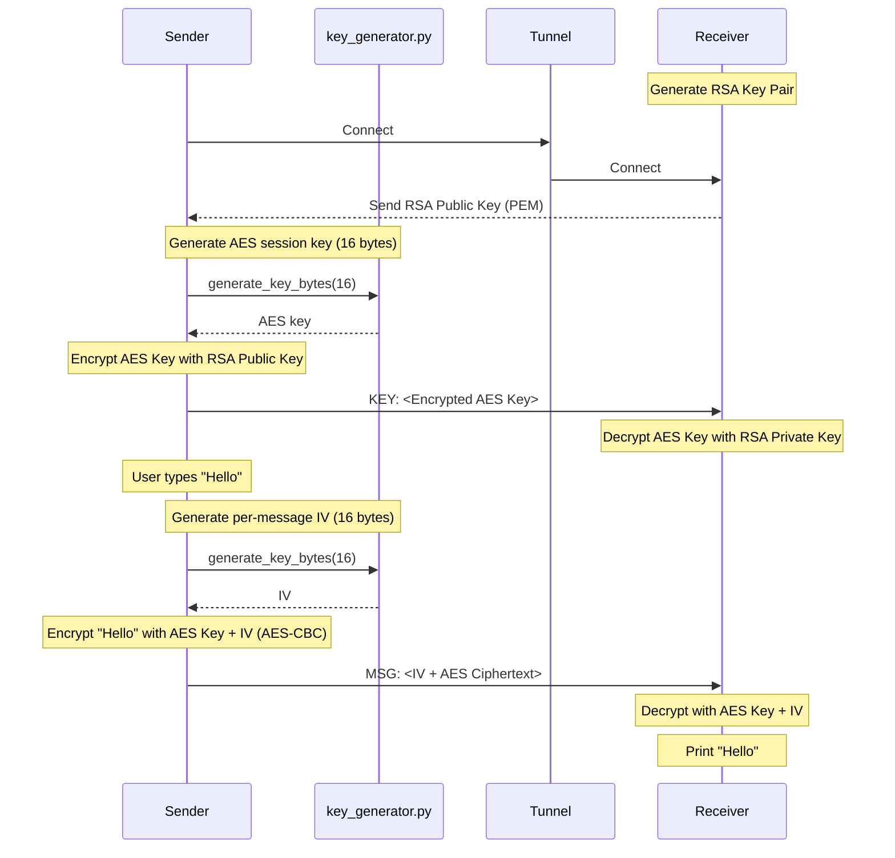

# Secure Connection Flow

This document explains how the `sender`, `unsecureTunnel`, and `receiver` establish a secure communication channel using a Hybrid Encryption scheme (RSA + AES).

## Components

1.  **Receiver (`receiver.py`)**: The server that holds the RSA Private Key and waits for messages.
2.  **Unsecure Tunnel (`unsecureTunnel.py`)**: A "Man-in-the-Middle" proxy that forwards traffic between Sender and Receiver. It can see the traffic but cannot decrypt the secure messages.
3.  **Sender (`sender.py`)**: The client that initiates the connection and sends encrypted messages.

## Protocol Steps

### 1. Initialization (Receiver)
*   **Action**: When `receiver.py` starts.
*   **Operation**: It generates a fresh **RSA 2048-bit Key Pair** (Public Key and Private Key).
*   **State**: The Receiver is now listening on port `65433`.

### 2. Connection & Public Key Exchange
*   **Action**: `sender.py` connects to `unsecureTunnel.py` (port `65432`), which forwards the connection to `receiver.py`.
*   **Handshake**:
    1.  **Receiver** immediately sends its **RSA Public Key** (in PEM format) to the Sender.
    2.  **Sender** receives and loads the Public Key.
    *   *Note: The Tunnel sees this Public Key, but it is public information.*

### 3. Session Key Exchange (Hybrid Encryption)
*   **Goal**: Establish a shared symmetric key for fast encryption (AES).
*   **Action**:
    1.  **Sender** generates an **AES session key** using the Collatz-based generator in `key_generator.py` (`generate_key_bytes(16)`).
    2.  **Sender** encrypts this AES Key using the **Receiver's RSA Public Key** (using OAEP padding with SHA-256).
    3.  **Sender** sends the encrypted key with the prefix `KEY:` (e.g., `KEY:<Base64 Encrypted Data>`).
    4.  **Receiver** receives the message, extracts the payload, and decrypts it using its **RSA Private Key**.
*   **Result**: Both Sender and Receiver now possess the same **AES Key**. The Tunnel only saw the encrypted blob and cannot derive the key.

### 4. Secure Messaging
*   **Action**: User types a message in the Sender terminal.
*   **Encryption (Sender)**:
    1.  Generates a **16-byte IV** (Initialization Vector) for this specific message using the Collatz-based generator (`generate_key_bytes(16)`).
    2.  Pads the message to be a multiple of 16 bytes (AES block size).
    3.  Encrypts the message using **AES-CBC Mode** with the Session Key and IV.
    4.  Concatenates `IV + Ciphertext`.
    5.  Encodes the result in Base64.
    6.  Sends `MSG:<Base64 Payload>`.
*   **Forwarding**: The Tunnel logs the message `MSG:...` but sees only gibberish.
*   **Decryption (Receiver)**:
    1.  Decodes the Base64 payload.
    2.  Extracts the first 16 bytes as the **IV**.
    3.  Decrypts the rest using **AES-CBC** with the Session Key and extracted IV.
    4.  Unpads the result to get the original plaintext.
    5.  Prints the decrypted message.

### What is an IV (Initialization Vector)?
An **IV** is a per-message value used by CBC mode.

- **Why it exists**: It prevents identical plaintext messages encrypted with the same key from producing identical ciphertext.
- **Is it secret?** No. The IV is sent along with the ciphertext so the receiver can decrypt.
- **In this project**: The IV is the **first 16 bytes** of the `MSG:` payload (`IV + Ciphertext`).

## Diagram

## Notes / Limitations

- This demonstrates a **hybrid encryption** idea (RSA for key exchange + symmetric cipher for data).
- AES is widely used in practice; this project still uses **AES-CBC** for learning/demo purposes.
- The Tunnel can see all traffic (public key, encrypted AES key, encrypted messages) but cannot decrypt without the RSA private key or AES session key.
